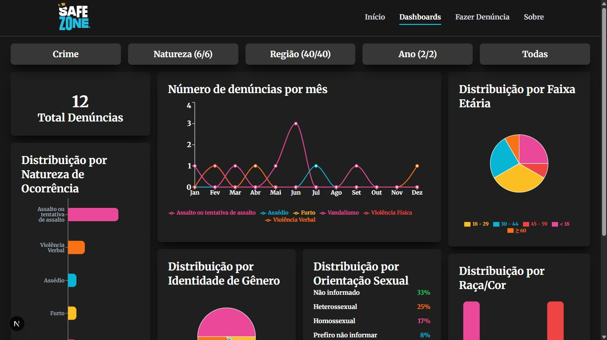
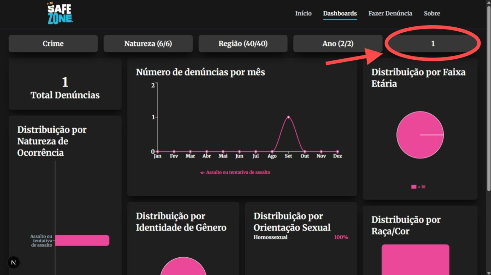

# Safe Zone

**Número da Lista:** Grupo 2  
**Conteúdo da Disciplina:** Árvores Balanceadas (Árvore Rubro-Negra)

## 👥 Equipe - Grupo 2

Dupla responsável pela implementação dos algoritmos e estruturas de dados na aplicação.

| Foto | Nome | Matrícula |
|------|------|-----------|
|  | **[Giovanna Felipe](https://github.com/giovannafg)** | 241038998 |
|  | **[André Henrique](https://github.com/andrehsb)** | 241025149 |

---

## 📖 Sobre

O **Safe Zone** é uma aplicação web em formato de dashboard projetada para analisar e processar dados sobre criminalidade e insegurança no Distrito Federal e entorno.

O objetivo é informar os cidadãos, facilitar a denúncia de ocorrências de forma menos burocrática e auxiliar na tomada de decisões mais direcionadas por parte dos órgãos competentes, garantindo o anonimato dos usuários.

---

## 📸 Screenshots




---

## 🛠️ Tecnologias

| Categoria | Tecnologia |
|------------|------------|
| Framework Frontend | Next.js (App Router, SSR/SSG) |
| Linguagem | TypeScript e C# (.NET 9) |
| Estilização | Tailwind CSS |
| Backend API | ASP.NET Core API |
| Banco de Dados | Azure Cosmos DB (NoSQL) |

---

## 🚀 Instalação Rápida

### Clonar o repositório

```bash
git clone https://github.com/jj-viana/safe-zone.git
cd safe-zone
```

### 1. Configurar e rodar a API

```bash
cd api
dotnet restore
dotnet build
dotnet run
```

### 2. Configurar e rodar o Frontend (em outro terminal)

```bash
cd ../web
npm install
npm run dev
```

---

## 🔒 Variáveis de Ambiente

### Frontend (`web/.env.local`)

Crie um arquivo `.env.local` na pasta `web`:

```env
NEXT_PUBLIC_API_BASE_URL=http://localhost:5206
```

### Backend (`api/appsettings.Development.json`)

Crie um arquivo `appsettings.Development.json` na pasta `api`:

```json
{
  "CosmosDB": {
    "ConnectionString": "<SUA_CONNECTION_STRING_AQUI>",
    "DatabaseId": "ReportsDb",
    "ContainerId": "Reports"
  },
  "Cors": {
    "AllowedOrigins": [
      "http://localhost:3000"
    ]
  }
}
```

---

## ▶️ Scripts Úteis

### Frontend (`/web`)

```bash
npm run dev      # servidor de desenvolvimento (http://localhost:3000)
npm run build    # compila a aplicação para produção
npm run lint     # verifica erros no código TypeScript
```

### Backend (`/api`)

```bash
dotnet run       # inicia a API na porta 5206
```

---

## 💻 Uso

Ao acessar a aplicação, o usuário (cidadão) pode:

- Visualizar os dados de criminalidade;
- Acessar o dashboard interativo com estatísticas;
- Criar novos relatos no mapa de forma anônima.

Administradores autenticados possuem acesso a uma área restrita para:

- Moderar denúncias enviadas pelos usuários;
- Aprovar ou rejeitar relatos pendentes;
- Alimentar as estatísticas públicas com dados validados.

---

## 🔗 Outros

  - **VÍDEO DE APRESENTAÇÃO:**  
  https://youtu.be/4qAmx8q48M4

---


# 🌳 Estrutura de Dados Implementada para Otimização

## Árvore Rubro-Negra (Red-Black Tree)

O projeto utiliza uma **Árvore Rubro-Negra (Red-Black Tree)** executada diretamente na memória do frontend para organizar, processar e filtrar cronologicamente as denúncias carregadas do banco de dados.

---

## Justificativa da Utilização

Na arquitetura da aplicação, o frontend carrega as ocorrências e precisa organizá-las dinamicamente para alimentar os gráficos e filtros.

Uma árvore binária de busca comum (BST) poderia sofrer degradação severa de desempenho dependendo da ordem dos dados recebidos.

### Problema da Árvore Binária Simples (BST)

Se o banco de dados retornar os relatórios já ordenados por data (do mais antigo para o mais recente), cada novo elemento seria inserido sempre à direita do anterior.

Nesse cenário, a árvore deixaria de possuir uma estrutura balanceada e passaria a se comportar como uma lista encadeada:

```text
1
 \
  2
   \
    3
     \
      4
```

Como consequência:

- Altura da árvore: `O(n)`
- Busca: `O(n)`
- Inserção: `O(n)`

Com milhares de registros, isso poderia impactar significativamente a experiência do usuário.

---

### Solução com Árvore Rubro-Negra

A Árvore Rubro-Negra utiliza regras de coloração e rotações para garantir balanceamento automático.

Independentemente da ordem em que os dados são recebidos:

- Ordenados;
- Invertidos;
- Aleatórios;

a árvore mantém altura próxima do ideal.

Assim, as operações de:

- Busca;
- Inserção;
- Remoção;

mantêm complexidade:

```text
O(log n)
```

garantindo excelente desempenho mesmo com grandes volumes de denúncias.

---

## Onde a Árvore é Utilizada

### Dashboard Principal

Ao carregar a página principal (`http://localhost:3000`), todas as ocorrências validadas são inseridas na Árvore Rubro-Negra.

A chave utilizada para ordenação é:

```typescript
createdDate
```

convertida para milissegundos, permitindo a ordenação cronológica dos registros.

---

### Filtro de Ocorrências Recentes

Foi implementada uma travessia personalizada da árvore utilizando:

```text
Direita → Raiz → Esquerda
```

(Travessia Em-Ordem Reversa)

Essa estratégia permite recuperar rapidamente os registros mais recentes.

Os filtros:

- Top 10 ocorrências mais recentes;
- Top 50 ocorrências mais recentes;

utilizam essa travessia.

---

### Otimização Utilizada

A travessia possui uma condição de parada antecipada.

Exemplo:

- Se o usuário solicitar apenas as 10 ocorrências mais recentes;
- Após encontrar os 10 registros desejados;
- A busca é interrompida imediatamente.

Dessa forma, evita-se percorrer toda a árvore desnecessariamente.

---

## Benefícios Obtidos

✅ Busca eficiente em grandes volumes de dados

✅ Complexidade garantida de `O(log n)`

✅ Balanceamento automático

✅ Filtragem rápida de ocorrências recentes

✅ Menor custo de processamento no navegador

✅ Melhor desempenho na atualização dos gráficos React

✅ Escalabilidade para milhares de denúncias

---

## Conclusão

A utilização da **Árvore Rubro-Negra** permitiu organizar cronologicamente as denúncias de forma eficiente e escalável.

Seu balanceamento automático garante desempenho consistente independentemente da ordem dos dados recebidos do banco de dados, tornando possível alimentar os filtros e gráficos do dashboard com baixa latência e excelente experiência para o usuário.